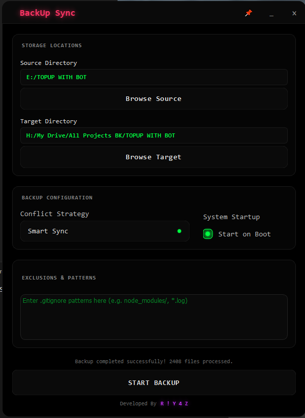

# 🌌 BackUp Sync

<p align="center">
  
</p>

<p align="center">
  
  
  
  
</p>

---

## ✨ Overview

**BackUp Sync** is a professional-grade, high-performance directory synchronization utility meticulously crafted for power users and developers. Combining a stunning **OLED Dark Aesthetic** with a robust synchronization engine, it ensures your data is always safe, organized, and synced with clinical precision.

Developed by **[R ! Y 4 Z](https://riyazz.dev)**, this tool isn't just a utility—it's a statement of UI/UX excellence.

---

## 🚀 Version 1.1.0 Highlights

The **Sync Capsule Update** (v1.1.0) introduces a complete rewrite of the real-time feedback system, focusing on 100% stability, modern HUD aesthetics, and interactive responsiveness.

- **💎 SyncPill Real-Time Capsule**: A sleek, always-on-top "Pill" dashboard located in the top-right corner. It provides live file counts, processed size (MB), and currently syncing file paths without any UI lag.
- **🔔 Native OS Notifications**: Fully integrated with Windows System Tray alerts. Critical job status messages (Success/Failure) now appear as native OS notifications for maximum reliability.
- **🔊 Audio Feedback System**: Integrated native Windows chimes (System Asterisk) that trigger upon successful backup completion for instant audio confirmation.
- **🖱️ Enhanced Tray Interaction**: Upgraded system tray logic now supports **Double-Click to Restore**, allowing instant window recovery from the background.
- **⚡ Performance First Architecture**: Removed legacy UI heartbeat timers to eliminate thread-contention. The sync engine now operates with optimized file-locking handlers.
- **⌨️ Global Hotkey Support**: Instant backup triggering using `CTRL + ALT + B` (configurable).
- **💾 Configuration Persistence**: All settings, filters, and custom hotkeys are now automatically saved and loaded on startup.

---

## 💎 Elite Features

### 🌌 Premium OLED Interface
- **Frameless Window Design**: Clean, modern edges with intuitive drag-and-drop movement.
- **Glassmorphism & Glow**: Custom components featuring neon glows and translucent frames.
- **Capsule HUD**: Real-time progress monitoring via a dedicated, synchronized top-right dashboard.
- **System Tray Core**: Optimized for background operations with persistent tray presence and double-click restore.

### ⚙️ Professional Sync Engine
- **Pattern Filtering**: Industrial-grade `.gitignore` support via `pathspec` to exclude `node_modules`, `.git`, temporary logs, and build artifacts.
- **Real-Time Analytics**: Monitor throughput (MB/s), file counts, and elapsed time with clinical accuracy.
- **Auto-Yielding Loop**: Thread-safe file operations that prevent system hammering and keep your OS smooth while syncing thousands of files.

---

## 🛠 Installation & Usage

### 📦 For Users (Executable)
1. Download the latest `BackUpSync_v1.1.0.exe` from the [Releases](#) tab.
2. Launch and select your **Source** and **Target** directories.
3. Configure your **Conflict Strategy** and **Filters**.
4. Hit **BACKUP** or use the global hotkey to sync instantly.

### 🧪 For Developers (Source)
```bash
# Clone the repository
git clone https://github.com/riyazalsodie/BackUpSync.git

# Enter the directory
cd BackUpSync

# Install dependencies
pip install PyQt6 keyboard pathspec

# Run the application
python main.py
```

---

## 📊 Technical Stack

| Component | Technology |
| :--- | :--- |
| **Core Framework** | Python 3.11+ |
| **GUI Framework** | PyQt6 (Qt v6.4+) |
| **Styling** | Custom QSS (Neon Glow Optimized) |
| **Background Logic** | Async Multi-threaded Engine |
| **Global Inputs** | Keyboard Hook Integration |
| **Audio** | Native Winsound API |

---

## 🤝 Contribution

Contributions are what make the open-source community such an amazing place to learn, inspire, and create. Any contributions you make are **greatly appreciated**.

---

## 📄 License

Distributed under the MIT License. See `LICENSE` for more information.

<p align="center">
  <br>
  Built with ❤️ by <b>R ! Y 4 Z</b>
</p>
